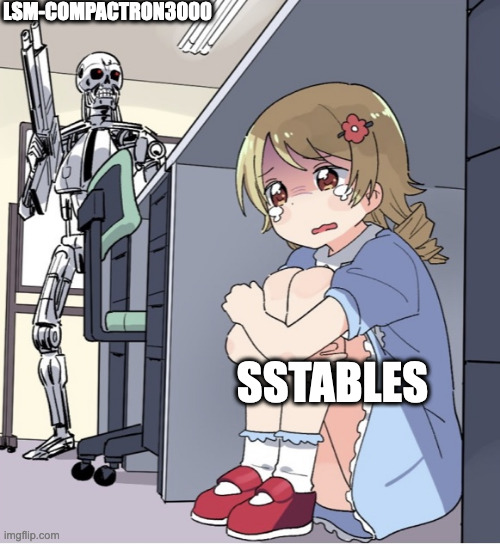

LSM-Compactron3000
=======================

> This project is BSc thesis project. It is still work in progress.
You can expect more updates in December 2023. Feel free to contribute but please do not expect any quick responses.

The FPGA-based accelerator for the compaction process in LSM-tree Key Value databases. The hardware design is described in [Chisel3](https://github.com/chipsalliance/chisel).

<p align="center">
  
</p>

## Useful notes

Those are some notes that are useful to myself.

### How does memory work in FPGAs?

Memory blocks in FPGAs are usually called **BRAM** (Block RAM). There is a distinct number of them on FPGAs. The number of blocks can be find in the board specification. You cannot use a fraction of memory from a BRAM block. Even if a fraction of memory is used in your design, the whole block will be consumed. You can instantiate BRAM blocks in your Verilog code. Each instantiation will use a whole block, so be careful not to run out of blocks. More details about BRAM can be found in [this blog post](https://community.element14.com/challenges-projects/design-challenges/summer-of-fpga/b/blog/posts/number-plate-recognition-3-implementing-block-ram-using-verilog).

In Chisel3, you can find details about how memory is implemented from [their docs](https://www.chisel-lang.org/chisel3/docs/explanations/memories.html).

### How tombstones are implemented in LSM KV stores?

When KV pair is removed, a special marker *tombstone* is added. The implementation of a tombstone depends on the LSM KV store. What is useful for us is that in case of merge if most recent KV pair is a tombstone it *can* be removed or not. It depends on the implementation. In our case, it seems not removing tombstone record is a better option that does not require any changes to the compaction process.

### The amount of BRAM memory required

The amount required of BRAM memory can be adjusted depending on the needs and the hardware used. The BRAM usage for this design is described in the table below.

| Module name    | BRAM per module      | Total of modules       | Total BRAM required |
|----------------|----------------------|------------------------|---------------------|
| KV Ring Buffer | 1 x BRAM, write/read | 5 (4 inputs, 1 output) | 5 x BRAM modules    |
| Key Buffer     | 1 x BRAM, write/read | 1                      | 1 x BRAM module     |

The memory size depends on maximum Key-Value (KV) pair sizes. The Teng Zhang et. al. paper proposed maximum key size of 2KB, maximum value size of 4KB, and metadata size of 2KB. In total, a single KV pair occupied 8KB of space. The assumed memory sizes from Teng Zhang et. al. paper for each module.

| Module name      | Memory size               | Memory bus width  | Notes |
|------------------|---------------------------|-------------------|-------|
| KV Ring Buffer   | 32 KV pairs x 8KB = 256KB | 64 bits (8 bytes) | Memory is noted in the paper, bus width isassumed from a context |
| Key Buffer       | 4 buffers x 2KB = 8KB     | 64 bits (8 bytes) | Memory and bus width are assumed |
| KV Output buffer | 32 KV pairs x 8KB = 256KB | 64 bits (8 bytes) | Assumed the same as KV Ring Buffer |

The values assumed from the paper require high-end FPGA. This design is adjusted to fit into a lower-end FPGA, particulary, *Zybo Zynq-7000*. 

[Zybo Zynq-7000](https://digilent.com/reference/programmable-logic/zybo/start) has 240KB (1920Kb) of BRAM memory. Each BRAM block has 36Kb of memory that can be further split into 2 x 18Kb. The reference for the board can be found [here](https://docs.xilinx.com/v/u/en-US/ds190-Zynq-7000-Overview). 

For on-device tests, let's assume that maximum key size is **32 bytes** (256b, 32 ASCII characters). The maximum value size is **192 bytes** (1536b). The total size of KV pair is **224 bytes** (1792b). 32 bytes are reserved for metadata. Making the total size of KV pair **256 bytes** (2048b).

The bus width is 8 bytes (64b). In case if 8-byte bus width occupies too much space on the FPGA, it can be reduced to 4 bytes (32b).

The proposed memory sizes are described in the table below.

| Module name      | Memory size                       | Notes |
|------------------|-----------------------------------|-------|
| KV Ring Buffer   | 18 KV pairs x 256B = 4.5KB = 36Kb | Using whole single BRAM module |
| Key Buffer       | 4 x 32B = 128B                    | Still occupies a single BRAM module |
| KV Output buffer | 18 KV pairs x 256B = 4.5KB = 36Kb | The same as KV Ring Buffer |

## Resources

- [FPGA code samples for different interfaces written in Chisel2](https://github.com/maltanar/fpga-tidbits)
- [FPGA shells with wrappers for different interfaces written in Chisel](https://github.com/sifive/fpga-shells)
- [Collection of different useful small Chisel3 projects](https://github.com/j-marjanovic/chisel-stuff)
- [Project that shows how Chisel and Rust can have a custom peripherals](https://github.com/ekiwi/pynq)
- [Verilog Axi](https://github.com/alexforencich/verilog-axi)
- [Collection of AXI4, Wishbone and other interfaces in Verilog ](https://github.com/ZipCPU/wb2axip)
- [Version control for Vivado](https://www.fpgadeveloper.com/2014/08/version-control-for-vivado-projects.html/)

### Zynq DMA tutorials

- https://www.youtube.com/watch?v=tQpt2N7__NQ
- https://www.youtube.com/watch?v=5gA3xnsSrdo
- https://www.youtube.com/watch?v=Ld01yPmW_Xw
- https://www.youtube.com/watch?v=5MCkjKhn1DM

- https://github.com/alexforencich/verilog-axi - verilog axi interfaces

- https://github.com/ZipCPU/wb2axip - AXI4, Wishbobe and other interfaces

### Zynq DMA tutorials

- https://www.youtube.com/watch?v=tQpt2N7__NQ
- https://www.youtube.com/watch?v=5gA3xnsSrdo
- https://www.youtube.com/watch?v=Ld01yPmW_Xw
- https://www.youtube.com/watch?v=5MCkjKhn1DM

### Others

- [Version control for Vivado](https://www.fpgadeveloper.com/2014/08/version-control-for-vivado-projects.html/)

## Development

### Create Docker Image

```bash
docker build -t scala:v1 .
docker run -v <absolute-path>/LSM-Compactron3000:/design -it scala:v1 bash
```

### Run

You can run the included test with:
```sh
sbt test
```

To run the main program, you can use:
```sh
sbt run
```
