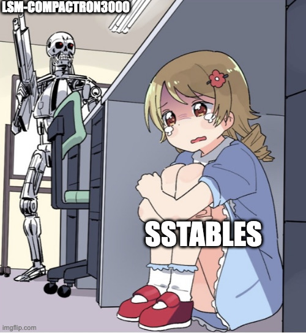

LSM-Compactron3000
=======================

[](https://doi.org/10.5281/zenodo.10429384)

The first open-source FPGA-based accelerator for the background compactions in LSM-tree Key Value databases. The hardware design is described in [Chisel3](https://github.com/chipsalliance/chisel) and tested on [Zybo Zynq-7000](https://digilent.com/reference/programmable-logic/zybo/start) board. 

For in-depth information on the design, please refer to the [BSc thesis](files/thesis.pdf). It explains internals of the accelerator, reasoining behind design decisions, potential design optimizations, etc.

If you are interested in continuing the development of this project, refer to the Conclusion section of the thesis. It provides some topics that can be further researched. Feel free to contact me if you have any questions.

<p align="center">
  
</p>

## Project structure

The project is split into two parts: hardware and software. The hardware part is described in Chisel3 and the software to test the accelerator is written in C and Python.

The hardware description is located in `src/` folder. It can be used to generate Verilog.
The `Vivado/` folder contains *Compaction Unit* IP that is used in the *LSM-Compactron3000* Vivado project to run on the Zybo board.

Unfortunately, due to the Vivado "great" ability to work with Git, the *LSM-Compactron3000* project cannot be opened in Vivado if you pull the repository. It worked on my machine (TM).It probably misses some generated files. CompactionUnit IP works correctly and can be used in other projects. Therefore, if you wish to run it on your hardware, you will need to build a Vivado project with all necessary IPs around Compaction Unit from scratch such as DMA controllers, etc. You can consult great tutorials collected in the [Resources](#resources) section.

The software is located in `src_c/` folder. Python code is responsible for generating a sample SSTables data. C code is used to control the accelerator and validate correctness of compaction. C code is designed for baremetal execution on the Zybo board.

## Development

In this section, you can find information on how to develop the project on your local machine. No special equipment is required. It assumed you have already forked/cloned LSM-Compactron3000 into a folder on your computer.

### Create Docker Image

You can install sbt and Scala on your local machine. Another option is to use Docker image provided in this repository.

```bash
docker build -t scala:v1 .
docker run -v <absolute-path-to>/LSM-Compactron3000:/design -it scala:v1 bash
```

### Run tests

You can run the Chisel3 tests with:
```sh
sbt test
```

### Generate Verilog

You can run one of the Scala programs that will generate, you can use:
```sh
sbt run
```

## Resources

### Great tutorial series on Zynq DMA

Based on those tutorials you can rebuild the Vivado project from scratch.

- [Custom AXIS IP in Vivado](https://www.youtube.com/watch?v=chs5mdwMchQ);
- [DMA and system level design](https://www.youtube.com/watch?v=5MCkjKhn1DM);
- [Developing DMA application on Zynq board](https://www.youtube.com/watch?v=x3KyWuhGmJg&t=2007s).

### Others

- [FPGA code samples for different interfaces written in Chisel2](https://github.com/maltanar/fpga-tidbits);
- [FPGA shells with wrappers for different interfaces written in Chisel](https://github.com/sifive/fpga-shells);
- [Collection of different useful small Chisel3 projects](https://github.com/j-marjanovic/chisel-stuff);
- [Project that shows how Chisel and Rust can have a custom peripherals](https://github.com/ekiwi/pynq);
- [Verilog Axi](https://github.com/alexforencich/verilog-axi);
- [Collection of AXI4, Wishbone and other interfaces in Verilog](https://github.com/ZipCPU/wb2axip);
- [Version control for Vivado](https://www.fpgadeveloper.com/2014/08/version-control-for-vivado-projects.html/), it is tricky to use Git with Vivado.
